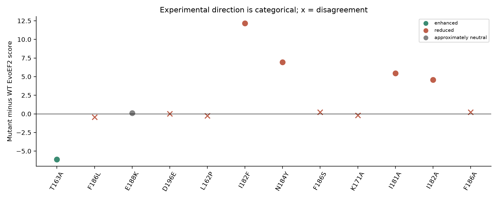
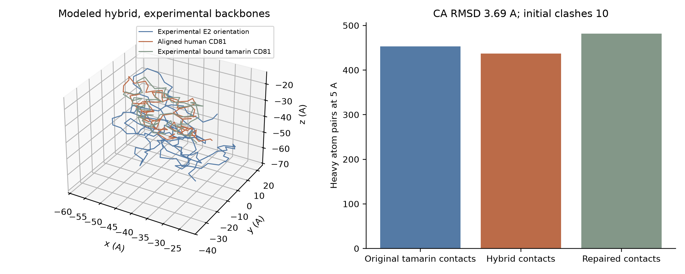
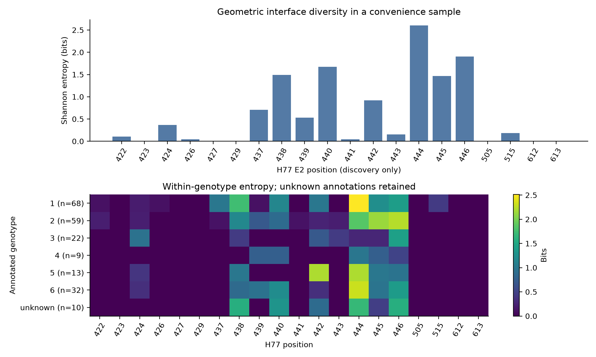
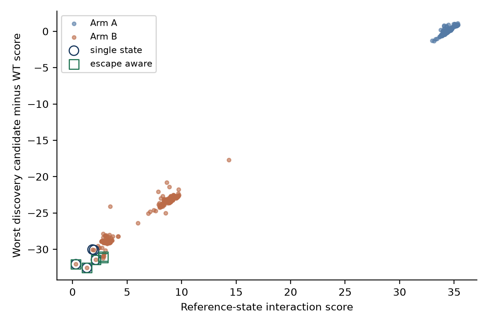
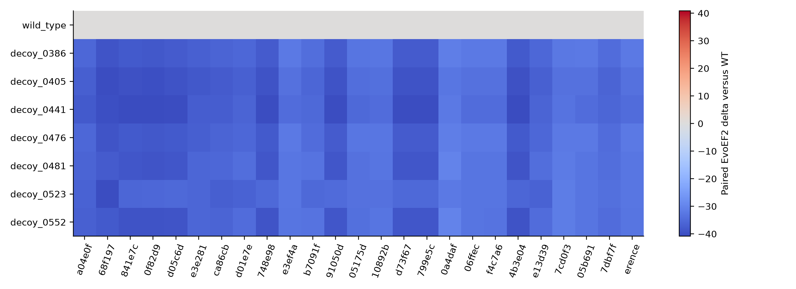
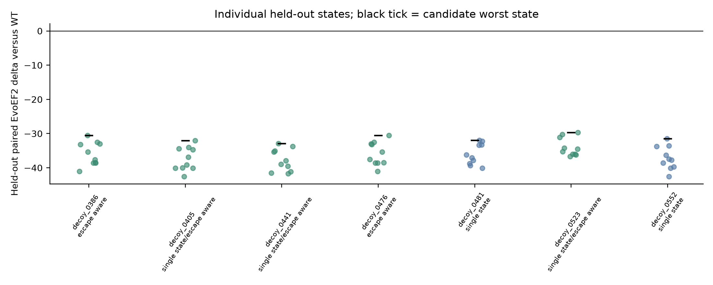
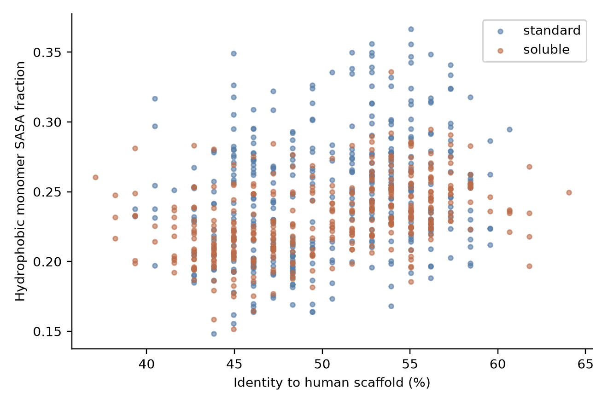
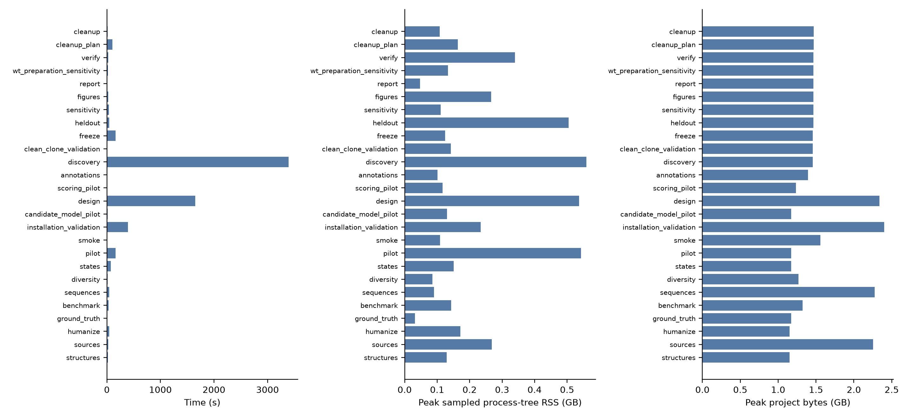

# EvoEF2 fails the CD81 directional benchmark in an escape-aware sequence-design experiment

## Summary

The interface scoring procedure recovered 5 of 11 distinct directional soluble-E2 mutation controls. The curated evidence contains 29 assay observations. This failed the predeclared directional validation gate, so every designed sequence remains a computational candidate and all structural scores are model outputs.

The run retrieved 309 GenBank records and retained 226. Official standard and soluble ProteinMPNN generated 760 sequences on the experimental human CD81 scaffold; 759 unique sequences passed sequence constraints. Escape-aware selection changed the mean candidate worst paired score by 0.48 EvoEF2 score units relative to single-state selection across 10 held-out E2 states. The paired state-bootstrap interval was [0.08, 0.54]. Escape-aware selection did not lower the held-out worst paired model score. Lower scores are favored within this model. The score benchmark failure prevents interpreting this effect as better binding.

## Background

HCV E2 engages the large extracellular loop of CD81 during entry. A soluble receptor-derived construct is a receptor-mimic hypothesis, while membrane CD81 also participates in later entry events. Published soluble-E2 binding and pseudoparticle entry effects can disagree. Inverse folding samples amino-acid sequences conditioned on coordinates. This experiment performs constrained de novo sequence design on an experimental backbone; ProteinMPNN does not generate a new fold here.

Natural E2 variation creates a multi-state selection problem. The comparison uses one generated pool and two transparent selection rules. Single-state selection minimizes the reference score. Escape-aware selection minimizes the largest candidate-minus-WT score across discovery states, then its median. WT is scored under the same state geometry. Unlike a weighted sum, these rules do not mix NLL, charge and exposure into one arbitrary quantity.

## Data

The experimental complex [7MWX](https://www.rcsb.org/structure/7MWX) contains Saguinus oedipus (tamarin) CD81. Homo sapiens in its expression-system metadata does not identify the receptor species. The human scaffold is [3X0E](https://www.rcsb.org/structure/3X0E). The human E2:CD81 complex is a modeled hybrid constructed from these two experimental structures. The CA alignment RMSD was 3.69 A. Original downloaded mmCIF files are kept untouched and excluded from Git; checksum and chain/entity audits are tracked.

Primary ground truth comes from Higginbottom, Drummer, Bertaux and Dragic, and Flint. The supplied attribution for the Different domains paper was corrected using its primary record. Assay directions remain qualitative; no plotted values were digitized. See [ground truth](config/cd81_mutation_ground_truth.tsv) for source-specific construct, assay, strain uncertainty, replicate information and excluded secondary summaries.

The bounded GenBank sample excluded 83 records for translation, ambiguity, interface-coverage or modeling failures. H77 AF009606.1 provides one-based polyprotein numbering. Exact E2 sequences retain accession multiplicity. The cluster split assigned 213 discovery and 13 held-out accessions. Connected interface haplotypes differing at no more than one site remain together. Unequal connected-component sizes prevent an accession-balanced split. The compact discovery panel represented 39.4% of discovery observations, below the arbitrary target. Unknown genotypes remain explicitly unclassified.

## Pipeline

Each stage is independently callable through the CLI. Retrieval stores original bytes and checksums. Humanization uses sequence matching and rigid CA superposition, followed by lightweight sidechain repair. Natural sequences are aligned to H77 using Biopython affine-gap alignment; observed structure residues are mapped separately. This avoids installing a second aligner. Conservation uses discovery sequences only. The split builder quarantines test sequences before design. A file-open audit guard and explicit discovery-only function inputs enforce the boundary.

ProteinMPNN fixes the E2 sequence and designs only receptor chain R. Arm A preserves the geometric interface and experimental recognition constraints. Arm B permits the remaining reliable contacts to vary. Both preserve native disulfide cysteines and reject additional cysteines. Standard and soluble models receive matched seeds, temperatures and budgets. Effective seeds are verified from upstream output headers. The pilot generated 100 sequences in 157.4 seconds; its sequences are excluded from the comparison pool. The full budget was fixed from pilot throughput before structural candidate scores. The projection was 1196.2 seconds, while generation took 1649.3 seconds. Repeated loading and concurrent installation may explain part of this difference; their effects were not isolated.

Scoring builds each receptor on the reference complex once and recombines it with separately modeled E2 sidechains. State-specific receptor repacking is omitted. This makes the cross-state conformational assumption explicit. Candidate freeze hashes bind sequences, configuration, software and discovery inputs before held-out evaluation. Pareto exposure/score tradeoffs are annotated separately. The clash tolerance is arbitrary. The freeze retains each strategy's selections, including overlap.

```bash
bash scripts/00_configure.sh --threads 2 --ram 14 --disk 13 --seed 20261004 --yes
bash scripts/02_install.sh
bash run_all.sh --mode core --parallel
bash scripts/19_verify.sh
```

## Results

Experimental validation comes first. EvoEF2 failed the benchmark despite recovering the enhanced T163A direction. The exact binomial interval for directional concordance is [0.167, 0.766]; related assay backgrounds limit its independence interpretation. An always-reduced direction baseline would recover 10 of 11 controls. F186L was effectively neutral under the declared score tolerance, contrary to the soluble-E2 observations. Experimental assay units were not pooled and no continuous experimental correlation was claimed.



The modeled human conformation differs substantially from the bound tamarin conformation. Sidechain repair cannot resolve uncertainty about the backbone orientation.



Discovery interface entropy varies by H77 position. Sampling and the compact panel limit any statement about circulating diversity.



Reference-state preference and worst discovery paired scores differ. The two strategies share an identical generation budget and candidate pool.



The frozen heatmap includes WT as a paired zero comparator in every state. Scores above zero favor WT under the model.



Held-out candidates were evaluated only after the candidate table and its manifest were written. The effect estimate is 0.48, with interval [0.08, 0.54]. Escape-aware selection did not lower the held-out worst paired model score. Each point is a viral structural state. Excluding genotype 2 changed the strategy effect to 0.08; this subset accounts for much of the observed difference. The small test sample and correlated haplotype components limit inference. The final table carries the failed-benchmark warning next to every computational candidate. [Strategy comparisons](results/heldout_strategy_comparison.tsv) retain both median and worst-case paired deltas, and [generalization changes](results/strategy_generalization.tsv) retain discovery-to-test differences for each frozen computational candidate. An additional native-WT repair pass changed held-out state scores by at most 0.00 score units and retained the failed directional gate and the strategy effect. This checks the native-versus-mutated optimization-path difference without changing the freeze.



The measured soluble-minus-standard hydrophobic SASA fraction differences were Arm A: -0.0188, paired seed-bootstrap interval [-0.0277, -0.0103]. Arm B: -0.0127, paired seed-bootstrap interval [-0.0212, -0.0043]. These compare matched generation seeds within each arm. Arm A's largest hydrophobic patch proxy increased by 6.69 square A despite its lower hydrophobic exposure fraction, so these descriptors do not show a uniform soluble-model advantage. [Model comparisons](results/model_comparison_effects.tsv) retain seed-level uncertainty for exposure, patch size, composition, charge and total monomer energy. Lower hydrophobic exposure cannot demonstrate expression, folding or solubility. The [candidate summary](results/candidate_summary.tsv) places sequences, mutation lists, geometric metrics and discovery/test statistics in flat columns for inspection.



The recorded run contains 20 failures, including a missing runtime for the upstream Windows EvoEF2 executable, unsupported upstream README options, and long-path failure. Local static compilation and verified-source defaults resolved those execution issues. Scientific stages and the reproduced locked installation used peak sampled process-tree RSS of 0.560 GB and peak measured project footprint of 2.401 GB. Summed successful stage durations were 6868.1 seconds; stages that overlapped are not summed wall-clock time.



## Repository structure

`pipeline/` contains the implementation. `scripts/` provides Bash entry points. `config/` records thresholds, ground truth, fixed residues, upstream commits and split assignments. `results/` contains derived tables and freeze hashes. `figures/` contains scripted raster figures and exportable PDFs. `data/processed/` keeps the compact experimental hybrid, states and frozen models. `data/raw/`, `data/work/`, `.venv/` and `vendor/` are ignored. `tests/fixtures/` contains an offline synthetic example. `logs/` records scientific-stage resources and failures. [Score definitions](docs/score_dictionary.md) state what each output can support.

After evaluation, 1604 individually hashed disposable PDB files were removed. The [cleanup audit](results/disposable_model_manifest.tsv) records each file and its retained evidence. Frozen models, controls, state structures, checkpoints and original ProteinMPNN outputs remain available.

## Usage

Create a local environment with Python and install the locked dependencies. This host required its explicit Python executable because the default command resolved to an older runtime. For the offline smoke test, a CPU tensor runtime, external repositories and model weights are unnecessary.

```powershell
python -m venv .venv
.\.venv\Scripts\python.exe -m pip install numpy biopython scipy matplotlib psutil pyyaml pytest
.\.venv\Scripts\python.exe -m pipeline.cli configure --yes
.\.venv\Scripts\python.exe -m pipeline.cli smoke
.\.venv\Scripts\python.exe -m pytest -q
```

For the scientific run, use Git Bash and the installation command above. The resource guard measures current free disk and protects a non-project reserve. Installed environments, model weights, caches and generated files are counted. The measured footprint was 2.401 GB. The original bootstrap preceded instrumentation, so its peak cannot be reconstructed. A canonical locked installation was reproduced in a disposable environment with telemetry and wheel hashes. Independent stages have resource records. Exact environment versions and model hashes are in the manifests.

Git, Bash and a C++ compiler are host prerequisites. Scientific entry points provide `--help`. `--mode smoke` runs bundled analytical fixtures, while `--from heldout` resumes from the immutable freeze. Fresh runs score serially; `--parallel` opts into the configured worker count after the scoring memory pilot. Core and full both honor the pilot-approved compact budget, so full cannot expand past the measured ceiling. Existing outputs are checked before reuse. Atomic table writes preserve completed outputs if a later write fails.

After a completed frozen evaluation, `python -m pipeline.cleanup --plan` validates the retained outputs and writes the per-file model manifest without deleting anything. `python -m pipeline.cleanup --apply` removes only unchanged files listed in that manifest. It preserves raw sources, checkpoints and generation outputs and refuses paths outside the audited model directories.

To begin an independent scientific analysis, run `python -m pipeline.new_run --destination data/work/new_analysis`. The helper refuses an existing destination, copies code and predeclared settings, and initializes Git with `.gitignore` first. Set up that directory's own environment and follow the scientific commands there. It retrieves contemporary query results and records its own freeze. The archived result tables in this repository belong to the present run. The exact locked environment targets Python 3.14 on Windows; another platform or compiler requires a separate software audit, and an executable hash mismatch is reported rather than silently accepted.

## Limitations

The model combines an unbound human receptor conformation with the experimentally bound tamarin orientation. The large alignment RMSD is the greatest structural uncertainty. Fixed backbones omit E2 conformational flexibility; only reliably mapped sidechain substitutions are modeled. Coordinates absent from the experiments are not invented. Native WT uses the repaired reference; mutated sequences require BuildMutant followed by postmutation repair. This creates an optimization-path difference, which the extra WT repair sensitivity checks. Protein-only scoring removes glycans and other heteroatoms, whose removed identities are recorded. Complete-virion accessibility is not represented.

EvoEF2 interaction outputs are not experimental affinity, KD or rigorous binding free energy. The experimental score gate failed. ProteinMPNN NLL measures conditional sequence compatibility. Stability and SASA outputs do not measure folding, expression or solubility. The literature includes heterogeneous soluble, cellular and entry assays, and some viral strain identifiers are not established in the directly reported methods. The convenience sequence sample and incomplete panel introduce sampling bias. Small, unbalanced held-out sets and connected haplotype dependence weaken the bootstrap interpretation. Genotype-stratified outputs retain unknown and mixed-genotype states.

No generated sequence has experimental binding measurements. Soluble CD81 differs from membrane CD81 in oligomerization, trafficking and later entry biology. Its interactions with other human proteins, immune effects, specificity, safety and pharmacology are unknown. This project uses no molecular dynamics, docking or de novo backbone generation. Original bootstrap telemetry is unavailable, and shellcheck availability is reported by verification.

The least certain conclusion is that the observed held-out strategy score difference would persist under a different receptor conformation. The humanization mismatch and failed experimental directional benchmark allow that difference to be driven by placement and sidechain-packing artifacts.

## Data availability

Public identifiers and accepted NCBI queries are recorded in [datasets](config/datasets.tsv), [download hashes](results/download_manifest.tsv), [sequence exclusions](results/hcv_sequence_manifest.tsv) and [structure provenance](results/structure_provenance.tsv). Cached accession snapshots reproduce this run; fresh default-order query results may change. Each external source can be retrieved through the corresponding CLI stage:

```bash
bash scripts/stage.sh structures
bash scripts/stage.sh humanize
bash scripts/stage.sh ground_truth
bash scripts/stage.sh sequences
bash scripts/stage.sh diversity
```

## Citation

The verified primary citations are [Kumar et al.](https://doi.org/10.1038/s41586-021-03913-5), [Yang et al.](https://doi.org/10.1096/fj.15-272880), [Higginbottom et al.](https://doi.org/10.1128/JVI.74.8.3642-3649.2000), [Drummer et al.](https://doi.org/10.1128/JVI.76.21.11143-11147.2002), [Bertaux and Dragic](https://doi.org/10.1128/JVI.80.10.4940-4948.2006), and [Flint et al.](https://doi.org/10.1128/JVI.00104-06). Software sources, exact commits and usage terms are recorded in [software provenance](results/software_manifest.tsv).

## License

Original code is MIT licensed. Third-party code and weights are retrieved independently and excluded from Git. ProteinMPNN supplies MIT-licensed code and bundled weights; no distinct model-weight license was found, so a separate grant is not assumed. EvoEF2's MIT license file conflicts with its academic-use README language. Its local binary and source are not redistributed. PDB and GenBank usage and article-specific copyright are recorded in [license audit](results/license_audit.tsv). Source article prose and figures are not redistributed.
